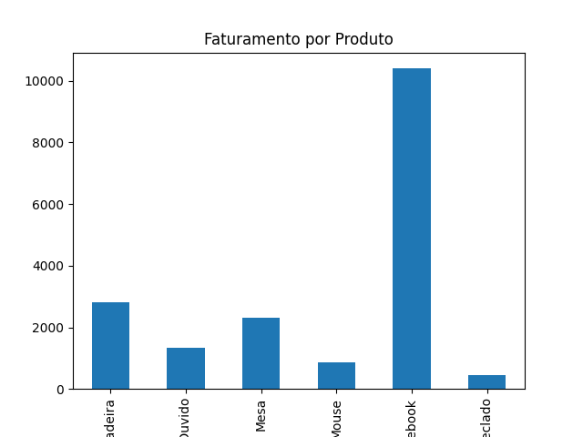
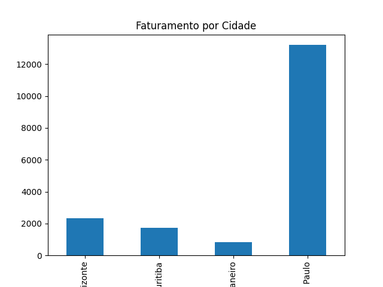

# 📊 Sales Data Pipeline

Projeto de engenharia de dados desenvolvido em Python com o objetivo de simular um pipeline completo de dados, desde a ingestão até a geração de relatórios e visualizações.

---

## 🚀 Tecnologias utilizadas

- Python
- Pandas
- SQLite
- Matplotlib

---

## 📂 Estrutura do projeto

- `data/raw` → dados brutos (CSV)
- `src/` → scripts de ETL (extract, transform, load)
- `database/` → banco de dados SQLite
- `output/reports` → relatórios gerados
- `output/charts` → gráficos

---

## 📊 Resultados

### Faturamento por Produto


### Faturamento por Cidade


---

## 📌 Objetivo

Este projeto demonstra habilidades práticas em:

- Manipulação de dados
- Criação de pipelines
- Automação de processos
- Geração de insights a partir de dados

---

## ▶️ Como executar

```bash
python test.py
